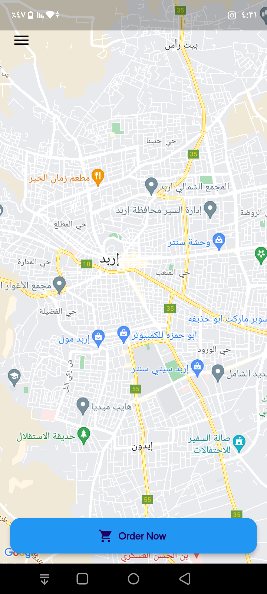
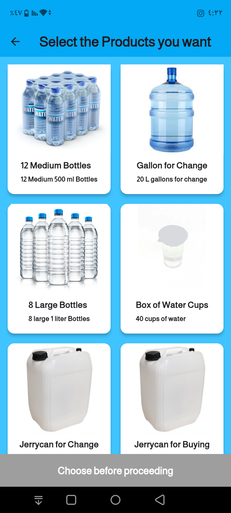
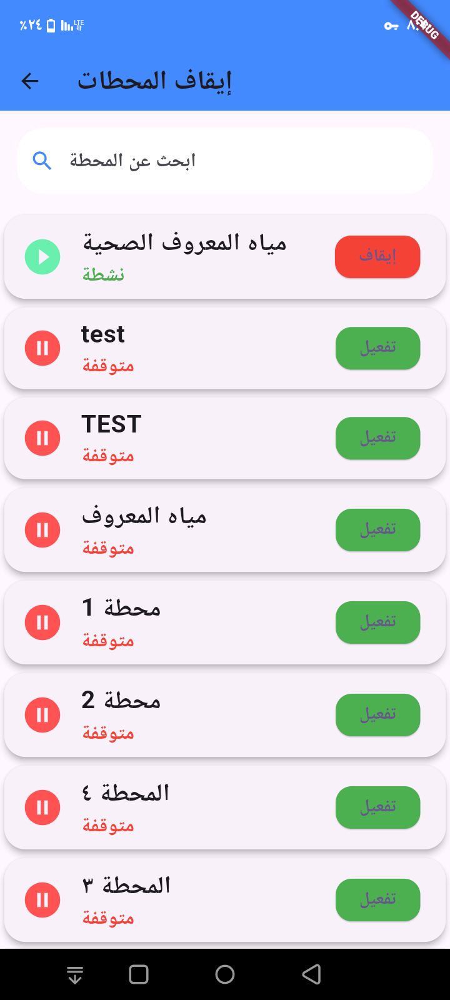

# Nabaa Water-Delivery Platform — Early University Project Archive

This repository preserves three Flutter applications developed during my early university years:

- **Customer app** — browse water products, choose a station, select a delivery location, place orders, and review previous orders.
- **Station/provider app** — manage station information and products, review incoming orders, and update delivery status.
- **Administration app** — manage stations, users, vouchers, and commission-related workflows.

The project was an ambitious early attempt to build a real-time water-delivery platform using Flutter, Firebase Authentication, Cloud Firestore, Firebase Cloud Messaging, Google Maps, and GetX.

## Important status

This is a historical software archive, not a production system. The code intentionally retains its early structure and several architectural weaknesses so that it remains an honest record of the project. It should not be deployed against the original Firebase project.

The public version has been sanitized: private credentials, signing material, live Firebase configuration, personal contact details, live notification endpoints, and generated build caches were removed or replaced with placeholders. A separate screenshot set is included as a visual reference; remaining names, phone numbers, email addresses, order records, and address fields in those images were covered before publication.

## Repository layout

```text
apps/
├── customer/          # Original water_delivery_app
├── station-provider/  # Original station_app
└── admin/             # Original nabaaadmins
docs/
├── configuration.md
├── known-issues.md
├── security-audit.md
├── screenshots/       # Sanitized UI references and screenshot galleries
└── legacy-fragments/  # Incomplete historical code kept for reference
PUBLISH_TO_GITHUB.md
SECURITY.md
```

## Historical features

The three applications demonstrate an intended platform with:

- email/password and Google-based authentication flows;
- Arabic and English interface content;
- product and station browsing;
- station operating locations and schedules;
- map-based customer location selection;
- residential details for delivery;
- order creation, acceptance, rejection, and completion;
- vouchers, ratings, commissions, and order history;
- Firebase Cloud Messaging token storage and notification experiments.

## Technologies represented

- Flutter/Dart
- Firebase Authentication
- Cloud Firestore
- Firebase Cloud Messaging
- Firebase Crashlytics and Analytics references
- Google Maps and geolocation packages
- GetX state management
- Shared Preferences

The dependency versions are historical snapshots. Modern Flutter, Gradle, Android Gradle Plugin, Kotlin, and package versions may require compatibility changes before any app can run.

## Visual references

The following images are sanitized visual references from the early project. They document the intended interfaces; they are not evidence that the archived code is production-ready.

### Customer app




Full gallery: [customer app screenshots](docs/screenshots/customer/README.md).

### Station/provider app


Full gallery: [station/provider app screenshots](docs/screenshots/station-provider/README.md).

### Administration app




Full gallery: [administration app screenshots](docs/screenshots/admin/README.md).

## Running locally

The archive deliberately contains no Firebase project configuration. Each app uses placeholders supplied through Dart compile-time values. Configure a private test Firebase project before running anything.

From an app directory:

```bash
flutter pub get
flutter run \
  --dart-define=FIREBASE_API_KEY=YOUR_TEST_VALUE \
  --dart-define=FIREBASE_APP_ID=YOUR_TEST_VALUE \
  --dart-define=FIREBASE_MESSAGING_SENDER_ID=YOUR_TEST_VALUE \
  --dart-define=FIREBASE_PROJECT_ID=YOUR_TEST_PROJECT_ID
```

The customer and station/provider apps also accept:

```text
NOTIFICATION_FUNCTION_URL=https://YOUR-TEST-ENDPOINT
```

Google Maps will remain unavailable until a restricted test Maps key replaces the local placeholder in the Android manifest. Do not commit that local configuration. See [docs/configuration.md](docs/configuration.md).

## Architectural limitations preserved in the archive

The code contains direct Firestore access from widgets, duplicated business logic, dynamic maps and string field names, global GetX state, broad collection reads, incomplete notification experiments, hardcoded assumptions about roles, and multi-step order/commission writes without a server-side transaction or idempotency strategy. The archive also contains no Firestore or Storage Rules and no complete backend implementation.

These are documented in [docs/known-issues.md](docs/known-issues.md). They are part of the historical record and are not presented as production recommendations.

## Security and privacy

Read [SECURITY.md](SECURITY.md) before using or publishing this repository. In particular, do not reuse the old repository history or its tags when creating the public repository. The original projects contained credentials and signing material that must be considered compromised if they were ever active or shared.

The included screenshot copies were reviewed and sanitized for public presentation. The original screenshot package should remain private. See [docs/screenshots/README.md](docs/screenshots/README.md).

## License

No open-source license has been selected for this archive yet. Public visibility does not by itself grant permission to reuse the code. Add a license only after deciding how you want the historical material to be used.
